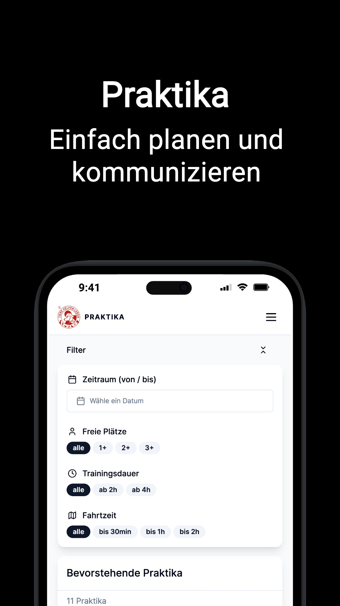

# THL Praktika

[thl-praktika.vercel.app/about](https://thl-praktika.vercel.app/about)

Eine Web App und PWA um Praktika Koordination zu vereinfachen. Gebaut für die Ausbildung zum ganzheitlichen Hundeverhaltenstrainer bei THL.

## Contribution

- create a `.env.local` file, for local development.
- run `pnpm dev` for local development.
- check out `package.json` for available scripts.

## Changelog

[https://thl-praktika.vercel.app/changelog](https://thl-praktika.vercel.app/changelog)

## Repository Analatics

